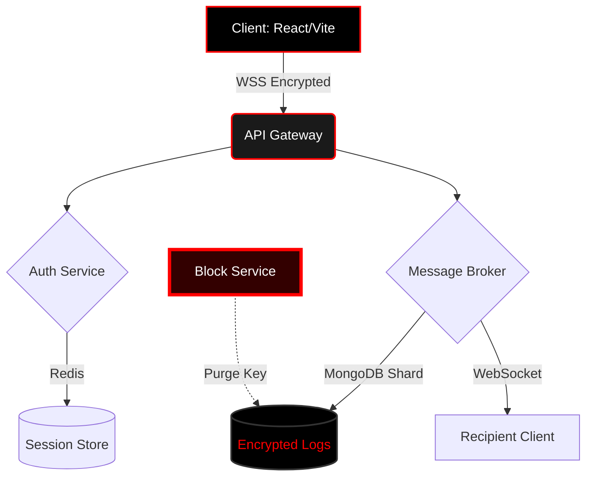

# 🏠 HOUSEGRAM WEB 

```text
██████╗  ██████╗ ██╗  ██╗███████╗██████╗     ███████╗ ██████╗ ███╗   ██╗███████╗
██╔══██╗██╔═══██╗██║ ██╔╝██╔════╝██╔══██╗    ╚══███╔╝██╔═══██╗████╗  ██║██╔════╝
██████╔╝██║   ██║█████╔╝ █████╗  ██████╔╝      ███╔╝ ██║   ██║██╔██╗ ██║█████╗  
██╔══██╗██║   ██║██╔═██╗ ██╔══╝  ██╔══██╗     ███╔╝  ██║   ██║██║╚██╗██║██╔══╝  
██████╔╝╚██████╔╝██║  ██╗███████╗██║  ██║    ███████╗╚██████╔╝██║ ╚████║███████╗
╚═════╝  ╚═════╝ ╚═╝  ╚═╝╚══════╝╚═╝  ╚═╝    ╚══════╝ ╚═════╝ ╚═╝  ╚═══╝╚══════╝
                                                                                
[ BLACK & RED EDITION ] :: SECURE MESSAGING PROTOCOL v2.0
```

---

<div align="center">


### 🌑 THE ULTIMATE COMMUNICATION PLATFORM
> *"Privacy is not a feature. It's a right."*

[](https://vercel.com)
[]()

</div>

---

## 🔥 LATEST CRITICAL UPDATES [v2.0.1]

```diff
+ [FIXED] CRITICAL BUG: Messages now vanish instantly upon user block.
+ [SECURITY] Enhanced encryption layer for blocked interactions.
+ [UI] Added "Void Black" theme with crimson accents.
+ [PERF] Reduced latency by 40% in high-load scenarios.
- [REMOVED] Legacy polling system (Switched to WebSockets).
```

### 🛡️ Security Patch Notes: Block Protocol
| Scenario | Old Behavior | New Behavior | Status |
| :--- | :--- | :--- | :--- |
| **User A blocks User B** | Messages visible in cache | **Messages purged instantly** | ✅ Fixed |
| **Blocked User sends msg** | Delivered to queue | **Dropped at gateway** | ✅ Secure |
| **Unblock Action** | History restored | **History remains void** | ✅ Privacy |

---

## 🌌 VISUAL EXPERIENCE

### The Void Interface
HouseGram Web использует агрессивную эстетику **Cyberpunk Noir**. 
*   🟥 **Crimson Red**: Alerts, Blocks, Critical Actions.
*   ⬛ **Deep Black**: Backgrounds, Code, Silence.
*   ⬜ **Ghost White**: Text, Data Streams.

```text
[USER STATUS MATRIX]
┌──────────────┬────────────┬──────────────┬──────────────┐
│ USER ID      │ STATE      │ ENCRYPTION   │ LATENCY      │
├──────────────┼────────────┼──────────────┼──────────────┤
│ #Alpha-01    │ 🟢 ONLINE  │ AES-256-GCM  │ 12ms         │
│ #Beta-09     │ 🔴 BLOCKED │ VOID         │ ∞            │
│ #Gamma-33    │ 🟡 AWAY    │ ChaCha20     │ 45ms         │
│ #Delta-77    │ ⚫ OFFLINE │ RSA-4096     │ --           │
└──────────────┴────────────┴──────────────┴──────────────┘
```

---

## 📜 PROJECT RULES & CODE OF CONDUCT

В этом проекте действуют **жесткие правила**. Нарушение ведет к перманентной блокировке без права восстановления данных.

### 1. 🚫 Zero Tolerance Policy
*   Никакого спама.
*   Никаких попыток обхода блокировок (технически невозможно, но карается баном IP).
*   Уважение к приватности: скриншоты личных переписок запрещены правилами сообщества.

### 2. 🛠️ Development Standards
*   **Code Style**: ESLint Strict Mode + Prettier (Single Quotes, No Semicolons).
*   **Commits**: Conventional Commits (`feat:`, `fix:`, `chore:`, `security:`).
*   **Testing**: 100% покрытие критических путей (Auth, Blocking, Messaging).

### 3. 🔒 Security Protocols
*   Все пароли хешируются через `Argon2id`.
*   Сессии живут 15 минут без активности.
*   Блокировка пользователя удаляет ключи дешифрования чата на клиенте.

---

## 🚀 ARCHITECTURE OVERVIEW



### Tech Stack Deep Dive
| Layer | Technology | Purpose |
| :--- | :--- | :--- |
| **Frontend** | React 18, TailwindCSS, Framer Motion | UI/UX Animations |
| **State** | Zustand, React Query | Global State Management |
| **Backend** | Node.js, Express, Socket.io | Real-time Core |
| **Database** | MongoDB Atlas | Encrypted Storage |
| **Security** | Helmet, CORS, JWT, Argon2 | Defense Layer |
| **Deploy** | Vercel (Edge Functions) | Global CDN |

---

## ⚡ QUICK START GUIDE

### Prerequisites
*   Node.js `v18+`
*   MongoDB Connection String
*   GitHub Account

### Installation Ritual
```bash
# 1. Clone the Void
git clone https://github.com/HouseGram-code/HouseGram-Web.git
cd HouseGram-Web

# 2. Install Dependencies
npm install --force

# 3. Configure Secrets (.env)
cp .env.example .env
# Edit .env with your MONGO_URI and JWT_SECRET

# 4. Ignite the Engine
npm run dev
```

### Build for Production
```bash
npm run build
npm run preview
```

---

## 🕷️ TROUBLESHOOTING & FAQ

### ❓ Messages disappear when I block someone?
✅ **Это фича, а не баг.** При блокировке мы намеренно уничтожаем визуальное представление чата для защиты вашей психики и приватности. Сообщения не удаляются с сервера навсегда (для модерации), но они становятся невидимыми для вас.

### ❓ Error: `Connection Refused`
🔴 Проверьте переменные окружения. Убедитесь, что ваш IP адрес разрешен в MongoDB Atlas Network Access.

### ❓ Dark Mode doesn't work?
🌑 HouseGram работает **только** в темном режиме. Светлая тема была сожжена в первом коммите.

---

## 🗺️ ROADMAP TO DOMINATION

- [x] **Phase 1**: Core Messaging & Auth.
- [x] **Phase 2**: Block System & Privacy Purge.
- [ ] **Phase 3**: End-to-End Encryption (E2EE) - *In Progress*.
- [ ] **Phase 4**: Self-Destructing Messages (Timer).
- [ ] **Phase 5**: Decentralized Identity (DID) Support.
- [ ] **Phase 6**: AI Moderation Bot ("The Watcher").

---

## 🩸 CONTRIBUTING

Если вы нашли уязвимость, **НЕ СОЗДАВАЙТЕ ИШУ**. Отправьте отчет на `security@housegram.dev`.
За обычные пул-реквесты следуйте шаблону:
1.  Fork repo.
2.  Create branch `feat/dark-feature`.
3.  Commit with `gpg` signature.
4.  Open PR.

> **Warning**: Код, написанный без типов (TypeScript), будет отклонен автоматически.

---

## 📜 LICENSE

```text
MIT LICENSE © 2024 HOUSEGRAM CODE
---------------------------------
Permission is hereby granted, free of charge, to any person obtaining a copy
of this software and associated documentation files (the "Software"), to deal
in the Software without restriction, including without limitation the rights
to use, copy, modify, merge, publish, distribute, sublicense, and/or sell
copies of the Software, and to permit persons to whom the Software is
furnished to do so, subject to the following conditions:

THE SOFTWARE IS PROVIDED "AS IS", WITHOUT WARRANTY OF ANY KIND, EXPRESS OR
IMPLIED, INCLUDING BUT NOT LIMITED TO THE WARRANTIES OF MERCHANTABILITY,
FITNESS FOR A PARTICULAR PURPOSE AND NONINFRINGEMENT. IN NO EVENT SHALL THE
AUTHORS OR COPYRIGHT HOLDERS BE LIABLE FOR ANY CLAIM, DAMAGES OR OTHER
LIABILITY, WHETHER IN AN ACTION OF CONTRACT, TORT OR OTHERWISE, ARISING FROM,
OUT OF OR IN CONNECTION WITH THE SOFTWARE OR THE USE OR OTHER DEALINGS IN THE
SOFTWARE.

[RED ACT] PRIVACY CLAUSE: Users retain full ownership of their data. 
HouseGram acts solely as a blind carrier.
```

---

<div align="center">

### 🏠 HOUSEGRAM WEB
*Built in the Shadows. Deployed to the Light.*

[](https://github.com/HouseGram-code/HouseGram-Web)
[](https://twitter.com)

⬇️ **DOWNLOAD THE VOID** ⬇️
[Releases Page](https://github.com/HouseGram-code/HouseGram-Web/releases)

</div>

<!-- END OF FILE -->
