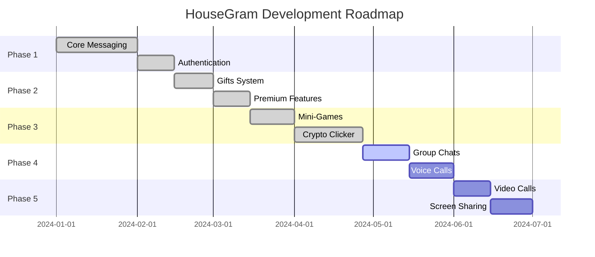

<div align="center">

# 🏠 HouseGram Web


<p align="center">
  
  
  
  
</p>

<p align="center">
  <a href="#-features">Features</a> •
  <a href="#-demo">Demo</a> •
  <a href="#-quick-start">Quick Start</a> •
  <a href="#-documentation">Documentation</a> •
  <a href="#-roadmap">Roadmap</a> •
  <a href="#-contributing">Contributing</a>
</p>


</div>

---

## 🌟 About HouseGram

**HouseGram Web** is a modern, feature-rich messaging platform inspired by Telegram, built with cutting-edge web technologies. Experience seamless communication with beautiful animations, mini-games, cryptocurrency features, and much more!

<div align="center">

### 🎯 Our Mission

> *"To create the most beautiful, secure, and feature-rich messaging experience on the web"*

</div>

---

## ✨ Features

<table>
<tr>
<td width="50%">

### 💬 **Messaging**
- 🚀 Real-time messaging with Firebase
- 📝 Text formatting (bold, italic, code)
- 🎤 Voice messages
- 📎 File attachments
- 🖼️ Image sharing
- ✏️ Edit & delete messages
- ↩️ Reply to messages
- ➡️ Forward messages
- 👁️ Read receipts
- ⌨️ Typing indicators

</td>
<td width="50%">

### 🎨 **Customization**
- 🎨 Custom theme colors
- 🖼️ Wallpaper support
- 🌓 Dark mode
- 💎 Glass morphism effects
- ✨ Smooth animations
- 🎭 Animated emojis
- 🎪 Stickers & GIFs
- 🎬 Framer Motion effects

</td>
</tr>
<tr>
<td width="50%">

### 🎮 **Mini-Games**
- 💰 **Crypto Clicker** - Earn HouseCoin!
- 🔥 Click upgrades system
- ⭐ Auto-farm feature
- 📊 Real-time statistics
- 🏆 Leaderboards (coming soon)
- 🎯 More games coming!

</td>
<td width="50%">

### 🎁 **Gifts & Premium**
- 🎁 Send animated gifts
- 💎 10+ beautiful gifts
- ⚡ Lightning (Stars) system
- 👑 Premium subscription
- 🎨 Premium emojis
- 🌟 Exclusive features

</td>
</tr>
<tr>
<td width="50%">

### 🔐 **Security**
- 🔒 Google Authentication
- 🛡️ Firebase Security Rules
- 🔑 Secure data storage
- 🚫 Block users
- 🔐 Passcode lock
- 📱 Session management

</td>
<td width="50%">

### 📱 **Channels & Groups**
- 📢 Create channels
- 👥 Group chats (coming soon)
- 🔗 Invite links
- 📊 Subscriber count
- ✅ Official badges
- 🎖️ Founder badges

</td>
</tr>
</table>

---

## 🎬 Demo

<div align="center">

### 🌐 Live Demo

**Try it now:** [housegram.vercel.app](https://housegram.vercel.app)


### 📸 Screenshots

<table>
<tr>
<td></td>
<td></td>
</tr>
<tr>
<td></td>
<td></td>
</tr>
</table>

</div>

---

## 🚀 Quick Start

### Prerequisites

Before you begin, ensure you have the following installed:

- **Node.js** (v18 or higher)
- **npm** or **yarn**
- **Git**
- **Firebase Account**

### Installation

```bash
# 1️⃣ Clone the repository
git clone https://github.com/HouseGram-code/HouseGram-Web.git
cd HouseGram-Web

# 2️⃣ Install dependencies
npm install

# 3️⃣ Set up environment variables
cp .env.example .env.local
# Edit .env.local with your Firebase credentials

# 4️⃣ Run development server
npm run dev

# 5️⃣ Open in browser
# Navigate to http://localhost:3000
```

### Build for Production

```bash
# Build the application
npm run build

# Preview production build
npm run preview

# Deploy to Vercel
vercel deploy
```

---

## 📚 Documentation

<div align="center">

### 📖 Complete Documentation

<a href="./docs/README.md">
  
</a>

</div>

### 📑 Documentation Sections

<table>
<tr>
<td width="33%">

#### 🏗️ **Setup & Configuration**
- [Installation Guide](./docs/installation.md)
- [Firebase Setup](./docs/firebase-setup.md)
- [Environment Variables](./docs/environment.md)
- [Deployment Guide](./docs/deployment.md)

</td>
<td width="33%">

#### 🎨 **Customization**
- [Theming Guide](./docs/theming.md)
- [Adding Features](./docs/features.md)
- [Custom Components](./docs/components.md)
- [Styling Guide](./docs/styling.md)

</td>
<td width="33%">

#### 🔧 **Development**
- [Project Structure](./docs/structure.md)
- [API Reference](./docs/api.md)
- [State Management](./docs/state.md)
- [Best Practices](./docs/best-practices.md)

</td>
</tr>
<tr>
<td width="33%">

#### 🎮 **Features**
- [Mini-Games System](./docs/mini-games.md)
- [Gifts System](./docs/gifts.md)
- [Premium Features](./docs/premium.md)
- [Channels & Groups](./docs/channels.md)

</td>
<td width="33%">

#### 🔐 **Security**
- [Authentication](./docs/authentication.md)
- [Security Rules](./docs/security-rules.md)
- [Data Privacy](./docs/privacy.md)
- [Best Practices](./docs/security-best-practices.md)

</td>
<td width="33%">

#### 🐛 **Troubleshooting**
- [Common Issues](./docs/troubleshooting.md)
- [FAQ](./docs/faq.md)
- [Error Codes](./docs/errors.md)
- [Support](./docs/support.md)

</td>
</tr>
</table>

---

## 🛠️ Tech Stack

<div align="center">

### Frontend


### Tools & Libraries


</div>

<table>
<tr>
<td width="50%">

### Core Technologies
- **Next.js 15** - React Framework
- **React 18** - UI Library
- **TypeScript** - Type Safety
- **Tailwind CSS** - Styling
- **Firebase** - Backend & Auth

</td>
<td width="50%">

### Libraries & Tools
- **Framer Motion** - Animations
- **Lucide React** - Icons
- **Google GenAI** - AI Features
- **Vercel** - Deployment
- **ESLint** - Code Quality

</td>
</tr>
</table>

---

## 🗺️ Roadmap

<div align="center">

### 🎯 Development Timeline

</div>



### ✅ Completed Features

- [x] Real-time messaging
- [x] User authentication
- [x] File attachments
- [x] Voice messages
- [x] Stickers & GIFs
- [x] Gifts system
- [x] Premium subscription
- [x] Mini-games (Crypto Clicker)
- [x] Animated emojis
- [x] Channels

### 🚧 In Progress

- [ ] Group chats
- [ ] Voice calls
- [ ] More mini-games
- [ ] Leaderboards
- [ ] Cryptocurrency withdrawal

### 🔮 Planned Features

- [ ] Video calls
- [ ] Screen sharing
- [ ] Stories
- [ ] Polls
- [ ] Bots API
- [ ] Desktop app
- [ ] Mobile apps

---

## 📊 Project Statistics

<div align="center">


</div>

---

## 🤝 Contributing

We welcome contributions from the community! Here's how you can help:

### 🌟 Ways to Contribute

<table>
<tr>
<td width="33%">

#### 🐛 **Report Bugs**
Found a bug? [Open an issue](https://github.com/HouseGram-code/HouseGram-Web/issues/new?template=bug_report.md)

</td>
<td width="33%">

#### 💡 **Suggest Features**
Have an idea? [Request a feature](https://github.com/HouseGram-code/HouseGram-Web/issues/new?template=feature_request.md)

</td>
<td width="33%">

#### 🔧 **Submit PRs**
Want to code? [Contribution Guide](./CONTRIBUTING.md)

</td>
</tr>
</table>

### 📝 Contribution Guidelines

1. **Fork** the repository
2. **Create** a feature branch (`git checkout -b feature/amazing-feature`)
3. **Commit** your changes (`git commit -m 'Add amazing feature'`)
4. **Push** to the branch (`git push origin feature/amazing-feature`)
5. **Open** a Pull Request

### 🎨 Code Style

- Use **TypeScript** for all new code
- Follow **ESLint** rules
- Write **meaningful** commit messages
- Add **comments** for complex logic
- Update **documentation** when needed

---

## 📜 License

<div align="center">

This project is licensed under the **MIT License** - see the [LICENSE](LICENSE) file for details.

```
MIT License

Copyright (c) 2024 HouseGram Code

Permission is hereby granted, free of charge, to any person obtaining a copy
of this software and associated documentation files (the "Software"), to deal
in the Software without restriction, including without limitation the rights
to use, copy, modify, merge, publish, distribute, sublicense, and/or sell
copies of the Software, and to permit persons to whom the Software is
furnished to do so, subject to the following conditions:

The above copyright notice and this permission notice shall be included in all
copies or substantial portions of the Software.

THE SOFTWARE IS PROVIDED "AS IS", WITHOUT WARRANTY OF ANY KIND, EXPRESS OR
IMPLIED, INCLUDING BUT NOT LIMITED TO THE WARRANTIES OF MERCHANTABILITY,
FITNESS FOR A PARTICULAR PURPOSE AND NONINFRINGEMENT.
```

</div>

---

## 🙏 Acknowledgments

<div align="center">

### 💖 Special Thanks

<table>
<tr>
<td align="center">

<br />
<sub><b>Inspiration</b></sub>
</td>
<td align="center">

<br />
<sub><b>Backend</b></sub>
</td>
<td align="center">

<br />
<sub><b>Hosting</b></sub>
</td>
<td align="center">

<br />
<sub><b>Framework</b></sub>
</td>
</tr>
</table>

### 🌟 Contributors

Thanks to all the amazing people who have contributed to this project!

<a href="https://github.com/HouseGram-code/HouseGram-Web/graphs/contributors">
  
</a>

</div>

---

## 📞 Contact & Support

<div align="center">

### 💬 Get in Touch

<table>
<tr>
<td align="center">
<a href="https://t.me/HouseGramBot">

</a>
<br />
<sub><b>Официальная поддержка</b></sub>
</td>
</tr>
</table>

### 🌐 Links

[](https://housegram.vercel.app)
[](./docs/README.md)
[](https://github.com/HouseGram-code)

</div>

---

<div align="center">

### 🏠 HouseGram Web


### ⭐ Star us on GitHub — it motivates us a lot!

[](https://github.com/HouseGram-code/HouseGram-Web/stargazers)
[](https://github.com/HouseGram-code/HouseGram-Web/network/members)
[](https://github.com/HouseGram-code/HouseGram-Web/watchers)

---

**Made with 💜 by the HouseGram Team**

*© 2024 HouseGram. All rights reserved.*

</div>
